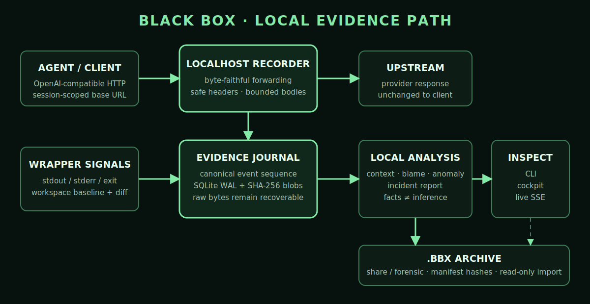

<pre align="center" role="heading" aria-level="1">
██████╗ ██╗      █████╗  ██████╗██╗  ██╗    ██████╗  ██████╗ ██╗  ██╗
██╔══██╗██║     ██╔══██╗██╔════╝██║ ██╔╝    ██╔══██╗██╔═══██╗╚██╗██╔╝
██████╔╝██║     ███████║██║     █████╔╝     ██████╔╝██║   ██║ ╚███╔╝
██╔══██╗██║     ██╔══██║██║     ██╔═██╗     ██╔══██╗██║   ██║ ██╔██╗
██████╔╝███████╗██║  ██║╚██████╗██║  ██╗    ██████╔╝╚██████╔╝██╔╝ ██╗
╚═════╝ ╚══════╝╚═╝  ╚═╝ ╚═════╝╚═╝  ╚═╝    ╚═════╝  ╚═════╝ ╚═╝  ╚═╝
</pre>

<p align="center">
  <samp><strong>LOCAL FLIGHT RECORDER FOR AI CODING AGENTS</strong></samp>
  <br />
  <samp>EVIDENCE, NOT GUESSWORK.</samp>
</p>

Black Box records what an AI coding agent saw, said, called, printed, and changed—then turns that evidence into an investigation you can inspect locally.

It runs as a CLI-managed localhost recorder with a browser cockpit. Put an OpenAI-compatible coding agent behind the byte-faithful proxy, or launch it through `blackbox run`, and Black Box builds a synchronized record of API traffic, model/tool events, process output, and workspace effects.

When an agent deletes a test, follows instructions hidden in a README, repeats a failing command, or drifts outside the user's request, Black Box helps answer:

- What exactly happened?
- What information was visible before the action?
- Which earlier evidence is linked to the action?
- Was the action inconsistent with the user's request?
- How complete—and how trustworthy—is the conclusion?

> Black Box does not read minds or expose private chain-of-thought. It preserves observable evidence, labels missing context, and keeps inference separate from fact.

## The investigation loop

```text
$ blackbox run -- <agent-command>
        │
        ├── record API request and response bytes
        ├── normalize messages, tool calls, results, errors, and usage
        ├── mirror bounded stdout and stderr
        └── observe workspace changes from baseline to final state

$ blackbox open
        │
        ├── TIMELINE   what happened, in sequence
        ├── CONTEXT    what the client made visible to the model
        ├── DIFF       what changed in the workspace
        ├── BLAME      which preceding evidence ranks highest, and why
        ├── REPORT     facts, hypothesis, alternatives, and prevention
        └── RAW        the retained evidence behind every claim
```



## Why Black Box exists

Normal agent logs tell only part of the story. A terminal transcript may show a command but not the model request that produced it. An API trace may show a tool call but not the file deletion that followed. A final Git diff shows the outcome but not the sequence, context, or transient behavior.

Black Box joins those signals into one evidence trail:

| Question                     | Black Box evidence                                                               |
| ---------------------------- | -------------------------------------------------------------------------------- |
| What did the client send?    | Byte-faithful request capture and canonical `model.request` events               |
| What came back?              | Ordered JSON/SSE response bytes, messages, tool calls, errors, and usage         |
| What did the process do?     | Command identity, bounded stdout/stderr frames, exit code, and signal            |
| What changed?                | Live approximate observations plus authoritative baseline-to-final file evidence |
| What context was visible?    | Reconstructed client-visible messages, tools, outputs, settings, and ancestry    |
| Why is an action suspicious? | Versioned deterministic ranking, hard provenance, anomaly rules, and limitations |
| How do I share the finding?  | Deterministic Markdown/JSON incident report with linked evidence and disclosure  |
| Can the result be verified?  | Clickable event, exchange, payload, hash, path, line, and correlation provenance |

## Quickstart

Requirements:

- Node.js 22.13 or newer
- npm 10 or newer
- An OpenAI-compatible agent or client that accepts a custom base URL

From this repository:

```bash
npm install
npm run build
npm run blackbox -- init
npm run blackbox -- doctor
```

Run an agent under the recorder:

```bash
npm run blackbox -- run -- <agent-command> [arguments...]
```

For example:

```bash
npm run blackbox -- run -- node ./path/to/agent.js
```

Open the local evidence cockpit:

```bash
npm run blackbox -- open
```

Inspect the journal from the terminal:

```bash
npm run blackbox -- sessions --json
npm run blackbox -- inspect <session-id> --json
npm run blackbox -- report <session-id>
```

`blackbox run` starts or reuses the daemon, creates one explicit session, injects a session-scoped `OPENAI_BASE_URL`, mirrors the child process, observes its workspace, and preserves the child's exit status.

The child must honor the injected base URL for Black Box to capture its provider traffic. Process and workspace evidence still work through the wrapper; `blackbox doctor` reports known transport and configuration limitations before a real run.

All examples below use the installed `blackbox` command for readability. When running from source, replace `blackbox` with `npm run blackbox --`.

## Run as a standalone proxy

If a client already supports a custom OpenAI base URL, start Black Box separately:

```bash
blackbox init
blackbox start --upstream https://api.openai.com
blackbox status
```

Point the client at the `OPENAI_BASE_URL` printed by `blackbox start`, then inspect its sessions:

```bash
blackbox sessions
blackbox open <session-id>
```

Configure the provider origin with `--upstream` or `BLACKBOX_UPSTREAM_URL`. Black Box deliberately does not use `OPENAI_BASE_URL` as its upstream because that variable points the client back to the recorder.

## What Black Box records

### API evidence

- OpenAI Responses and Chat Completions HTTP requests
- Non-streaming JSON and ordered SSE response traffic
- Status, safe headers, timing, completion, timeout, cancellation, and disconnect evidence
- Raw request/response payload references and chunk manifests
- Canonical messages, tool calls/results, errors, model usage, and response lifecycle events
- Parser failures and unknown provider items without discarding the raw evidence

The proxy preserves downstream status, relevant headers, response bytes, and SSE ordering. Normalization runs off the forwarding path so a parser failure cannot silently rewrite the original exchange.

### Process evidence

- Executable, arguments, working directory, process ID, and parent process ID
- Bounded, byte-preserving stdout and stderr frames
- Exit code, terminating signal, and success state
- Ctrl-C and SIGTERM forwarding with bounded final cleanup

### Workspace evidence

- Git-aware or plain-directory baseline and final manifests
- File create, modify, delete, and unchanged-content rename detection
- SHA-256 hashes, byte lengths, sensitivity labels, and retained bounded deltas
- Git binary patches for eligible tracked changes
- Approximate watcher timing for live visibility
- Authoritative exact final diff evidence for attribution

Black Box excludes `.git`, dependencies, common build/cache directories, its own data directory, and untracked Git-ignored paths. It records symlink targets but does not traverse directory symlinks.

### Capture levels

| Level             | Evidence available                                                             |
| ----------------- | ------------------------------------------------------------------------------ |
| `api`             | Proxy traffic, normalized model events, context, and API-derived tool evidence |
| `wrapped-process` | API evidence plus process output and repository-scoped workspace effects       |
| `adapter`         | Reserved for integrations that provide explicit agent/tool session identity    |

`wrapped-process` is the recommended investigation mode because it connects provider traffic to the command and workspace that produced the visible effect. Adapter contracts exist, but no agent-specific adapter is bundled yet.

## Browser evidence cockpit

The local React cockpit provides:

- Session navigation and live recorder health
- A virtualized, multi-lane event timeline
- Search over normalized event evidence
- Relative, local, and UTC timestamp modes
- Keyboard navigation and an accessible list mode
- Safe raw payload, header, provenance, and file-diff inspection
- Live SSE updates with cursor recovery after refresh
- Inert rendering for recorded HTML, Markdown, and script-like content

Open it with:

```bash
blackbox open [session-id]
```

The CLI transfers the local control credential through the URL fragment, does not print it during normal operation, and the viewer removes it from the visible URL after bootstrap.

## Context time travel

Select a `model.request` event and open the **context** tab.

For Chat Completions, Black Box reconstructs the explicit message history sent in the request. For Responses, it follows locally recorded `previous_response_id` ancestry with cycle, depth, and recorded-sequence guards.

Every result receives one of these completeness labels:

| Label                        | Meaning                                                    |
| ---------------------------- | ---------------------------------------------------------- |
| `exact-client-request`       | The understood context is explicit in the captured request |
| `reconstructed-client-chain` | The locally recorded response chain is complete            |
| `partial-client-chain`       | One or more required ancestors or payloads are unavailable |
| `provider-managed-context`   | Some context is resolved remotely by the provider          |
| `unknown-unsupported`        | The capture or protocol cannot support a stronger claim    |

Context items retain event, raw exchange, payload, role, ordering, and evidence-kind provenance. Provider-reported input usage is shown separately from Black Box's rough visible-content estimate.

Black Box never invents missing messages, hidden instructions, or private model reasoning.

## Deterministic blame

Select a `tool.call` or file action and open the **blame** tab.

Black Box first normalizes the target into its verb, path/entity, arguments, scope, result, and impact. It then considers only eligible evidence that preceded—and was available to—the target invocation.

Candidates are ranked locally using a versioned feature breakdown:

```text
score = 0.30 × provenance
      + 0.20 × BM25 / lexical similarity
      + 0.15 × path and entity overlap
      + 0.15 × conflict with recorded user intent
      + 0.10 × instruction-like language
      + 0.10 × recency
```

Hard provenance can include request-context membership, parent/call correlation, content hashes, exact paths, quoted substrings, explicit stored edges, and read-result propagation.

A high-confidence result requires complete relevant client context and at least one hard provenance edge. Similarity alone can never produce high confidence.

The panel shows:

- The primary stored excerpt and source location
- Ranked candidates and every feature value
- The evidence-propagation path
- Supporting evidence and counterevidence
- Alternative explanations
- Context and analysis limitations
- Clickable links back to the underlying stored events

The conclusion is an evidence-backed attribution—not proof of causation.

## Transparent anomaly rules

The same offline analysis pass checks for:

- Destructive work not named or implied by the user request
- A write or deletion outside the recorded repository root
- Instruction-like language arriving through untrusted file/tool content
- Repeated identical tool calls
- Repeated error-retry behavior
- High or uncertain context pressure
- Secret-like content in prompts or tool output

Each finding includes its rule ID, event IDs, inputs, threshold, severity, and explanation. Rule severities are not presented as calibrated probabilities, and matched secret values are not copied into findings.

Analysis results are versioned and cached as content-addressed local evidence.

## Incident reports

Generate a local Markdown report for the highest-impact recorded action:

```bash
blackbox report <session-id>
blackbox report <session-id> --target-event <event-id>
blackbox report <session-id> --json
```

The deterministic report is the default. It includes capture completeness, impact, a factual timeline, a separately labeled root-cause hypothesis, contributing conditions, counterevidence, alternative explanations, observed containment or recovery, prevention actions, limitations, and links back to event evidence. Recorded markup is escaped and the JSON form is versioned.

The same report is available in the cockpit's **report** tab. It is generated locally before any optional model workflow is offered.

### Optional AI explanation

AI enrichment is disabled unless dedicated analysis credentials are configured:

```bash
export BLACKBOX_ANALYSIS_API_KEY="..."
export BLACKBOX_ANALYSIS_MODEL="<structured-output-capable-model>"

# Optional for another OpenAI-compatible Responses endpoint:
export BLACKBOX_ANALYSIS_BASE_URL="https://api.openai.com/v1/"
export BLACKBOX_ANALYSIS_PROVIDER="openai"
```

Then either preview and confirm in the cockpit, or make the CLI opt-in explicit:

```bash
blackbox report <session-id> --ai
```

The CLI prints the local preflight before sending. The cockpit uses a separate preview and confirmation step; canceling the preview makes no provider call. Consent is bound to a fingerprint of the snapshot hash, provider, model, and prompt version, so any change requires a new review. Black Box minimizes evidence to declared categories, removes recognized secrets, shows exact category and byte counts, sends the redacted snapshot with provider storage disabled, and requires strict structured output. It rejects nonexistent event citations and excerpts that do not occur in the transmitted evidence.

AI can edit only the inferred narrative. It cannot replace the deterministic impact or factual timeline, raise confidence beyond the offline analysis, create provenance, or claim access to hidden reasoning. The disclosure records provider, model, prompt version, usage, redaction rules, snapshot hash, and a separate internal analysis session. Any provider, refusal, schema, or citation failure returns the original deterministic report intact.

## Evidence integrity

Black Box uses two layers of evidence:

1. **Raw evidence** preserves the exchange or observation as recorded.
2. **Derived evidence** normalizes and connects those observations for investigation.

The raw layer remains recoverable when normalization fails. Canonical events distinguish `observed`, `derived`, `inferred`, and `unknown` evidence. Per-session sequence numbers are monotonic, equal-time pagination is stable, blobs are content-addressed with SHA-256, and interrupted exchanges recover as explicitly incomplete rather than pretending to be complete.

SQLite runs in WAL mode so the cockpit can read while the recorder writes. Large payloads are compressed into content-addressed blobs, while small payloads may remain inline.

## Portable `.bbx` archives

Export a settled investigation as one versioned, self-contained file:

```bash
blackbox export <session-id> --output incident.bbx
blackbox import incident.bbx
```

The default `share` profile removes raw request/response bytes, payload blobs, absolute workspace scope, and upstream identifiers. It applies the same secret-redaction rules used by report minimization and includes redacted records plus matching deterministic JSON and Markdown reports. Use the more sensitive profile only when an authorized recipient needs the original evidence:

```bash
blackbox export <session-id> --output incident-forensic.bbx --profile forensic
```

| Profile    | Intended use                 | Contents                                                                 |
| ---------- | ---------------------------- | ------------------------------------------------------------------------ |
| `share`    | Review and incident handoff  | Redacted metadata, events, context, disclosure, and deterministic report |
| `forensic` | Authorized evidence transfer | Exact stored records and every referenced payload blob                   |

Forensic archives can contain prompts, source, filesystem paths, command output, and secrets found in payload bodies. Inspect them before transfer. Export refuses an existing destination unless `--force` is explicit.

Every archive has a canonical manifest, bounded entries, and SHA-256 hashes. Import verifies hashes, record counts, paths, relationships, blob coverage, and both report representations before writing anything. This detects corruption and modification, but it is **not a digital signature**: someone who can rewrite an archive can also recompute its hashes. Use a trusted transfer channel or an external signature when authenticity matters.

Imported sessions are marked `imported-readonly`. Database guards prevent evidence mutation, report generation stays offline and read-only, optional AI transmission is disabled, duplicate import cannot overwrite local evidence, and Black Box provides no action-replay command.

The complete version 1 layout and verification sequence are documented in [docs/archive-format.md](docs/archive-format.md).

## Retention and deletion

Deletion is explicit and plan-first. Without `--yes`, these commands only show what would change:

```bash
blackbox delete <session-id>             # dry run
blackbox delete <session-id> --yes       # apply displayed deletion
blackbox prune --older-than-days 30      # dry run by age
blackbox prune --max-bytes 10737418240   # dry run to a 10 GiB target
blackbox prune --older-than-days 30 --max-bytes 10737418240 --yes
```

Active sessions are never selected. Linked internal analysis sessions are included with their source investigation, each plan is revalidated before execution, and only blobs with no remaining evidence reference are collected. Set `--max-stored-bytes N` on `start`, `open`, `run`, or `doctor` to make the blob store refuse new payloads beyond a fixed ceiling; Black Box does not silently evict recorded evidence.

## Privacy and security

Black Box is local-first, not magically risk-free. Recordings can contain prompts, source code, file paths, and tool output; protect the data directory accordingly.

Implemented controls include:

- Loopback-only authenticated control API and cockpit
- Private per-install control token
- Restrictive data-directory and sensitive-file permissions
- Mandatory exclusion of authorization, cookie, and configured sensitive header values from persisted header evidence
- Hash-only handling for known credential-file names and oversized files
- Inert rendering and restrictive browser response policy for captured payloads
- No telemetry
- No external model call for context reconstruction, blame, or anomaly analysis
- Offline incident reports by default; optional report enrichment requires an exact local preflight and explicit consent

Recorded agent API requests still go to the configured upstream by design. Optional report analysis uses only the dedicated `BLACKBOX_ANALYSIS_*` configuration and never silently reuses general `OPENAI_API_KEY` credentials. Black Box forwards credentials in memory when required but does not persist them as header evidence.

Use `--home PATH` or `BLACKBOX_HOME` to select the private data directory.

See [docs/privacy.md](docs/privacy.md) for the stored-field and transmission boundary, [docs/capture-model.md](docs/capture-model.md) for evidence/completeness semantics, and [SECURITY.md](SECURITY.md) for vulnerability reporting and threat boundaries.

## Offline demo

The seeded rogue-agent incident runs without an API key, provider, or network connection. It resets a disposable repository, imports the checked-in transcript into a fresh private Black Box home, and generates the packaged CLI report:

```bash
npm install
npm run demo:offline
```

The command prints the session ID, report path, evidence home, and a command for opening the cockpit. It is safe to rerun: each invocation recreates only the dedicated `.blackbox-demo` workspace.

```bash
npm run demo:reset    # recreate the clean demo repository only
npm run demo:cleanup  # remove the disposable demo workspace
```

If a live provider is unavailable during a real investigation, process and workspace capture still complete through `blackbox run`, and deterministic inspection/reporting remains local. Provider traffic can only be recorded when the client reaches its configured upstream through the Black Box proxy.

## Troubleshooting

| Symptom                              | Check                                                                                                |
| ------------------------------------ | ---------------------------------------------------------------------------------------------------- |
| No API events                        | Confirm the child honors the injected `OPENAI_BASE_URL`; run `blackbox doctor` before retrying.      |
| Daemon or port conflict              | Run `blackbox status`, then `blackbox stop`; `doctor` identifies occupied listeners and stale state. |
| Cockpit does not open automatically  | Run `blackbox open` again and use the authenticated loopback URL printed by the CLI.                 |
| Export says the session is unsettled | Finish or stop the capture first; active and incomplete writes cannot be packaged safely.            |
| Import reports an integrity failure  | Treat the file as corrupt or modified. Obtain a new copy instead of bypassing verification.          |
| Storage quota is reached             | Preview `blackbox prune` with an age or byte target, inspect the plan, then rerun with `--yes`.      |

## Measured local smoke test

On 2026-07-20, the reproducible 100-sample loopback benchmark measured 8.610 ms of p95 proxy time-to-first-byte overhead on an Intel i7-9750H Mac running Node.js 22.20.0. The cockpit's initial HTML response completed in 2.269 ms at p95, and its three production assets totaled 99,523 bytes when gzipped. These are machine-specific smoke results—not browser render, Internet, streaming, or load-test claims. See the fixture hash, full distribution, method, and limitations in [docs/performance.md](docs/performance.md), then reproduce them with `npm run benchmark`.

## Supported today

| Capability                                  | Status                             |
| ------------------------------------------- | ---------------------------------- |
| OpenAI Responses over HTTP JSON/SSE         | Supported                          |
| OpenAI Chat Completions over HTTP JSON/SSE  | Supported                          |
| Byte-faithful response forwarding           | Supported and fixture-tested       |
| Wrapped process and workspace observation   | Supported                          |
| Live authenticated browser cockpit          | Supported                          |
| Client-visible context reconstruction       | Supported with completeness labels |
| Offline deterministic blame and anomalies   | Supported                          |
| Deterministic Markdown/JSON incident report | Supported                          |
| Explicit opt-in AI report explanation       | Supported through Responses JSON   |
| Redacted and full-fidelity `.bbx` archives  | Supported with verified import     |
| Read-only imported investigations           | Supported and database-enforced    |
| Dry-run deletion and retention pruning      | Supported                          |
| Responses WebSocket / Realtime              | Not supported; rejected explicitly |
| Non-OpenAI provider protocols               | Not yet supported                  |
| Provider-hidden context or chain-of-thought | Not observable and never claimed   |
| Active replay of recorded actions           | Not supported                      |
| Cloud sync or multi-user server             | Not supported                      |

## CLI reference

| Command                                                | Purpose                                                         |
| ------------------------------------------------------ | --------------------------------------------------------------- |
| `blackbox init [--home PATH]`                          | Create the private local data area                              |
| `blackbox doctor [--upstream URL] [--json]`            | Check runtime, ports, storage, upstream, and transport support  |
| `blackbox start [--upstream URL]`                      | Start the detached proxy and control server                     |
| `blackbox run [--cwd PATH] -- <command...>`            | Run one agent/process with API, process, and workspace evidence |
| `blackbox status [--json]`                             | Show daemon and recorder health                                 |
| `blackbox open [session-id]`                           | Start/reuse the daemon and open the authenticated cockpit       |
| `blackbox sessions [--limit N] [--json]`               | List recorded sessions                                          |
| `blackbox inspect <session-id> [--type TYPE] [--json]` | Read canonical events from the terminal                         |
| `blackbox report <session-id> [--ai] [--json]`         | Generate an offline report or explicitly opt into AI enrichment |
| `blackbox export <session-id> --output FILE`           | Create a redacted or explicit forensic `.bbx` archive           |
| `blackbox import <archive.bbx> [--json]`               | Verify and install a read-only investigation                    |
| `blackbox delete <session-id> [--yes]`                 | Preview or apply deletion of one investigation                  |
| `blackbox prune [--older-than-days N] [--max-bytes N]` | Preview or apply an age/size retention plan                     |
| `blackbox stop [--timeout-ms MS]`                      | Stop the daemon with bounded cleanup                            |

See the complete option list with:

```bash
blackbox --help
```

## Architecture

```text
                           configured provider
                                  ▲
                                  │ HTTP JSON / SSE
                                  │
agent or client ─────────► byte-faithful proxy ─────────► unchanged response
       │                          │
       │                          ├── raw exchange journal
       │                          ├── protocol normalization
       │                          └── session correlation
       │
       └── blackbox run ──────────┬── process stdout / stderr
                                  └── workspace baseline + observations + diff
                                                   │
                                                   ▼
                                      SQLite WAL + blob store
                                                   │
                         ┌─────────────────────────┼────────────────────────┬───────────────┐
                         ▼                         ▼                        ▼               ▼
                 authenticated queries       live event stream     deterministic analysis  .bbx archive
                         │                         │                        │               │
                         └─────────────────────────┴────────────────────────┴───────────────┘
                                                   │
                                                   ▼
                                           browser evidence cockpit
```

Repository layout:

```text
apps/
  cli/              command surface, daemon lifecycle, process wrapper
  daemon/           recorder proxy, archive/retention, normalization, local query API
  viewer/           React evidence cockpit
  demo-agent/       deterministic demo-agent foundation
packages/
  protocol/         versioned evidence and query contracts
  storage/          SQLite journal, repositories, migrations, blob store
  normalizers/      Responses and Chat Completions normalization
  context/          client-visible context reconstruction
  analysis/         deterministic blame, anomalies, reports, and AI safeguards
  adapters/         optional agent-integration foundation
  test-fixtures/    protocol and seeded incident fixtures
demo/               disposable rogue repository and transcript
docs/decisions/     architecture decision records
```

## Development

Install dependencies and run the full gate:

```bash
npm install
npm run check
```

Useful commands:

```bash
npm run format            # verify Prettier formatting
npm run lint              # lint implementation and tests
npm run typecheck         # check strict TypeScript contracts
npm test                  # run unit, contract, fixture, proxy, and lifecycle tests
npm run test:e2e          # build and test the packaged CLI/daemon path
npm run package:smoke     # pack, clean-install, and exercise the runtime packages
npm run release:preflight # run all local candidate gates without publishing
npm run build             # compile workspaces and package viewer assets
npm run demo:offline      # rebuild and rehearse the seeded incident without a provider
npm run benchmark         # rebuild and measure local proxy/cockpit overhead
npm run clean             # remove TypeScript build outputs
```

Black Box handles forensic evidence. Schema and fixture changes must preserve raw data, label uncertainty honestly, and keep credential-exclusion guarantees intact. Read [CONTRIBUTING.md](./CONTRIBUTING.md) before changing evidence contracts or golden fixtures.

## Project status

The core capabilities scheduled for milestones M0 through M9 are implemented in this source tree:

- Recorder contracts and golden fixtures
- Crash-safe storage and content-addressed blobs
- Byte-faithful proxy and CLI lifecycle
- Protocol normalization and sessionization
- Wrapped process and workspace evidence
- Authenticated live cockpit
- Client-visible context time travel
- Deterministic blame and transparent anomaly rules
- Deterministic incident reports and explicit opt-in AI explanation
- Tamper-evident share/forensic archives and read-only import
- Explicit retention, safe blob collection, and repeatable offline demo rehearsal

This is not a claim that a public package release is complete. Cross-platform clean-install validation, fallback media, signing, and release tagging remain release-operations work.

For the detailed product contract and milestone acceptance criteria, see:

- [design.md](./design.md)
- [plan.md](./plan.md)
- [Capture model](./docs/capture-model.md)
- [Protocol support](./docs/protocol-support.md)
- [Archive format](./docs/archive-format.md)
- [Three- and seven-minute demo script](./docs/demo-script.md)
- [Release checklist and CI boundaries](./docs/release-checklist.md)
- [Architecture decisions](./docs/decisions/)

## License

Black Box is licensed under the [Apache License 2.0](./LICENSE).
